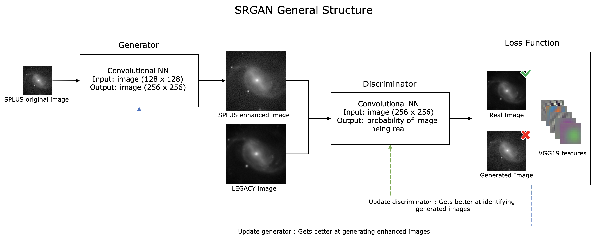

    <h2>Improving S-PLUS Image Quality with SRGANs</h2>

<h3> Abstract </h3>

Several factors contribute to noise in astronomical images. Random noise from the sky background, the telescope detector and optical system play a part to build noise in images that can make it difficult to identify and study structures. Schawinski et al. 2017 showed the potential of GANs for noise reduction and recovery of galaxy features for images artificially degraded [add solar denoise paper here]. In this project[work] we will use SRGANs to increase image quality (pixel density and signal to noise ratio) of S-PLUS survey images using deeper images of the same objects from Legacy survey as a baseline for training. Preliminary results were qualitatively evaluated and show good concordance with legacy survey images.

### 1. Introduction

&nbsp;&nbsp;&nbsp;&nbsp;&nbsp;&nbsp; Several factors contribute to noise in astronomical images: Random noise from the sky background, the telescope's detector and its optical system, and data modifications during preprocessing handling are examples of elements that play a part to build noise in images. Although there are known ways to decrease images' noise, such as bigger exposure times, totally removing the noise is virtually impossible. Furthermore, in some applications, increasing exposure times could mean reducing the covered field significantly. The noise present in images can have a big impact on its overall characteristics. Images with a low signal-to-noise ratio (S/N) are notably difficult to study as structures such as galaxies' spiral arms, and other features may get lost in the noise, making its detection and analysis harder. 

&nbsp;&nbsp;&nbsp;&nbsp;&nbsp;&nbsp; The contributions of deep learning in image astronomy have grown in the last years with uses in object classification (Bom et. al., 2021), image reconstruction (Bouman et. al., 2015), and others. In this context, machine learning and deep learning have been successfully used in astronomy for noise reduction with the use of principal component analysis (PCA), convolutional neural networks as shown by (Baso et. al., 2019), and more recently generative adversarial networks (GANs) (Schawinski et al., 2017).

&nbsp;&nbsp;&nbsp;&nbsp;&nbsp;&nbsp; Since the introduction of Generative Adversarial Networks by Goodfelow et al. (2014), we have observed the development of several uses in fields ranging from finances to arts; In particular, there were expressive developments in computer vision that lead to use in astronomy in the last years. GANs have been used to retrieve galaxy features and exoplanetary atmospheres  (Schawinski et al., 2017; Zingales and Waldmann., 2018), and to enhance cosmological simulations (Ullmo et al. 2020; Li et al., 2020) to cite a few use cases. Schawinski et al. 2017 showed the potential of GANs for noise reduction and recovery of galaxy features for images artificially degraded. In this work, we will use super-resolution generative adversarial networks (SRGANs), a class of GAN, to increase image quality (pixel density and signal-to-noise ratio) of S-PLUS survey images using deeper images of the same objects from LEGACY survey as a baseline for training.

### 2. Methodology

#### 2.1 Generative Adversarial Networks

&nbsp;&nbsp;&nbsp;&nbsp;&nbsp;&nbsp;Generative Adversarial Networks are a class of machine learning frameworks in which two neural networks are trained simultaneously against each other: A generator that tries to build increasingly realistic examples and a discriminator that increasingly gets better at identifying generated samples from real ones. The general goal of training a GAN is to create a generator that is able to output realistic examples of the objects of interest at the end of training. In the specific case of images, the generator could have different uses depending on its definition: it could create realistic face images using n-dimensional vectors as in style-GAN (Karras et. al., 2019), or it could transform images from one style to another (Isola et. al., 2018) to cite a few cases. In the particular case of SRGANs, the architecture used in this work, the purpose of the generator is to increase the resolution of the input image as introduced by Ledig et. al (2017). Figure 2.1 below shows the overall structure of the networks used in this work.

     
  Figure 2.1. SRGAN general structure used in this work.

&nbsp;&nbsp;&nbsp;&nbsp;&nbsp;&nbsp;Initially, a low-resolution image (128x128 S-PLUS original image) is inputed to the generator. The generator, through a series of convolutions and residual operations, transforms this image into a super-resolution image of size 256 x 256 pixels. The generated image is then given as an input to the discriminator training along with the real high-resolution image (256 x 256 LEGACY survey image of the same object). A Loss function is calculated using the output tensor of the discriminator as well as a feature representation of the image created using a pre-trained VGG19 network. After this phase, the weights and biases of the discriminator are updated, and it gets better at differentiating between generated and real images.

&nbsp;&nbsp;&nbsp;&nbsp;&nbsp;&nbsp;In a second phase, the loss function is used to update the weights and biases of the generator via backpropagation. After this step, the generator gets better at creating 256x256 images from a 128x128 input, it effectively gets better at fooling the discriminator. This training process repeats for each iteration and consists in solving the min-max adversarial problem shown bellow.

    

<a href="https://www.codecogs.com/eqnedit.php?latex=\large&space;min_{\theta&space;_{G}}max_{\theta&space;_{D}}\mathbb{E}_{I^{HR}\sim&space;p_{train}\left&space;(&space;I^{HR}&space;\right&space;)}\left&space;[&space;log&space;D_{\theta&space;_{D}}\left&space;(&space;I^{HR}&space;\right&space;)&space;\right&space;]&plus;\mathbb{E}_{I^{LR}\sim&space;p_{G}\left&space;(&space;I^{LR}&space;\right&space;)}\left&space;[&space;log\left&space;(&space;1-&space;D_{\theta&space;_{D}}\left&space;(G_{\theta_{G}}&space;I^{LR}&space;\right&space;)\right&space;)&space;\right&space;]" target="_blank">
</a>

    

&nbsp;&nbsp;&nbsp;&nbsp;&nbsp;&nbsp;Where  is an high-resolution image,  is a low-resolution image and  and  are the discriminator and the generator networks respectively parametrized by a set of weights and biases defined by  and   as defined in Ledig et. al (2017). The generative adversarial training process is known to be inherently unstable, and to avoid divergence and possible collapse during the training, hyperparameters, the network's architecture, and the training process should be finely tuned.

&nbsp;&nbsp;&nbsp;&nbsp;&nbsp;&nbsp;The architecture of the generator and the discriminator networks used in this work is very similar to the architecture proposed in (Ledig et. al.,2017) with minor changes to accommodate different input sizes and upscale factors. We also modified the upsampling interpolation method to bilinear since it gave better results and removed almost completely the high-frequency artifacts known as checkerboard pattern that was present in the first training interations.

#### 2.2 Data

&nbsp;&nbsp;&nbsp;&nbsp;&nbsp;&nbsp;To train the network we used images of objects in common between the S-PLUS and LEGACY survey. All images are from galaxies in the STRIPE82 region obtained from FITS images in the g, r, and z bands from both surveys where the resolution of S-PLUS images is 128x128 pixels and the resolution of LEGACY images is 256x256 pixels. The galaxies were selected visually trying to get an even distribution of samples from all the available regions. We also tried to avoid saturated stars and galaxies where images from S-PLUS had low quality. We selected 150 images in total, from which 25 were used for validation only and were not used in the network training.

&nbsp;&nbsp;&nbsp;&nbsp;&nbsp;&nbsp;The preprocessing of images consisted of an asinh shrinkage and a normalization. The shrinkage was in form  for S-PLUS images and   for LEGACY images. These constants were chosen in order to make the images from both surveys look as similar as possible. The min-max normalization assured pixel values would fall within the [0,1] interval before images were introduced in the network. To match exactly the field of view in images from both surveys we had to downsample the images from the LEGACY survey, this was achieved by changing the pixscale parameter to 0.277 in the LEGACY API.

&nbsp;&nbsp;&nbsp;&nbsp;&nbsp;&nbsp;To increase the number of training samples we collected randomly offset images of all 125 training objects summing a total of 250 images. Those images were then mirrored, flipped upside down, and rotated by 90 degrees. With this data augmentation process, we were able to increase the training sample eightfold from 125 to 1000 images.

### 3. Results

&nbsp;&nbsp;&nbsp;&nbsp;&nbsp;&nbsp;The SRGAN was trained for 500 epochs due to time restrictions, at this point, the training losses were still decreasing, albeit slowly.  To evaluate the network, the images generated using the validation set were evaluated both qualitatively and quantitatively. The qualitative check was made visually comparing the generated images with the real images from LEGACY survey. Figure 3.1 shows a sample of images from the validation set and compares original S-PLUS images with generated and LEGACY images.

     
  Figure 3.1. 

&nbsp;&nbsp;&nbsp;&nbsp;&nbsp;&nbsp;It can be noticed that for the sampled images, the super-resolution generated images (SPLUS - SR) present good similarities with the real ones from LEGACY and that the SRGAN was able to remove most of the noise present in the original images without removing most of the features in the images.

&nbsp;&nbsp;&nbsp;&nbsp;&nbsp;&nbsp;To evaluate the generator quantitatively, we used the peak signal to noise ratio metric (PSNR). This metric is often used to measure information loss in compressed images and measures the proximity of a noisy image in comparison with a baseline image. Given two images  and  of sizes ( pixels) where  is the max pixel value, the PSNR is defined as follows:

&nbsp;&nbsp;&nbsp;&nbsp;&nbsp;&nbsp;Table 3.1 below shows the average peak signal to noise ratio for the images in the validation set, using as baseline the real LEGACY images. The results show that the SRGAN is able to increase the PSNR of SPLUS images in 6.49 decibels on average and that the performance is homogeneous within different bands.

  Table 3.1. 

     

     
  Figure 3.2. 

### 4. Discussion and Conclusions

### 5. Future Work
- changes in architecture to get a network more suitable to reduce noise at the same time that it increases resolution
- Evaluate generator on more diverse objects, not only galaxies
- check for consistency using other metrics other than PSNR.
- Different loss function
- Features from a different model (not VGG)
- Check which vgg features get activated with galaxies images
- Low frequency artifacts might be caused by the generator trying to mimic legacy images' noise (it is a good idea to check if sone feature in VGG is activated by noise in images)
- Train with images with more consistent amount of noise
- Adjust preprocessing to decrease input noise

### 6. References

[Baso, C. J. D. ; Rodríguez, J.C.; Danilovic, S. 2019.](https://arxiv.org/abs/1908.02815) Solar image denoising with convolutional neural networks.    
[Bom, C. R.; Cortesi, A.; Lucatelli, G.; Dias, L. O.; Schubert, P.; Schwarz, G.B.O.; Cardoso, N. M.; Lima, E. V. R.; Oliveira, C.M.; Sodre Jr., L.; Castelli, A.V.S.;Ferrari, F.; Damke, G.; Overzier, R.; Kanaan, A.; Ribeiro, T.; Schoenell, W.. 2021.](https://arxiv.org/abs/2104.00018)Deep Learning Assessment of galaxy morphology in S-PLUS DataRelease 1.    
[Bouman, K. L.; Johnson, M.D.; Zoran, D.; Fish, V.L.; Doeleman, S.S.; Freeman, W.T.. 2015](https://arxiv.org/abs/1512.01413) Computational Imaging for VLBI Image Reconstruction.   
[Goodfellow, I. J. ; Abadie, J.P.; Mirza,M.; Xu, B.; Farley, D. W.; Ozair, S.; Courville, A.; Bengio, A.. 2014.](https://arxiv.org/abs/1406.2661) Generative Adversarial Networks.
[Isola, P.; Zhu, J.Y.; Zhou, T.; Efros, A.A.. 2018](https://arxiv.org/abs/1611.07004) Image-to-Image Translation with Conditional Adversarial Networks.   
[Ledig, C.; Theis, L.; Huszar, F.; Caballero, J; Cunningham, A.; Acosta, A.; Aitken, A.; Tejani, A.; Totz, J.; Wang, A.; Shi, W.. 2017.](https://arxiv.org/abs/1609.04802) Photo-Realistic Single Image Super-Resolution Using a Generative Adversarial Network. 
[Karras, T.; Laine, S.; Aila,T.. 2019](https://arxiv.org/abs/1611.07004) A Style-Based Generator Architecture for Generative Adversarial Networks.    
[Fussell, L.; Moews, B. 2018.](https://arxiv.org/abs/1811.03081) Forging new worlds: high-resolution synthetic galaxies with chained generative adversarial networks.       
[Li, Y.; Ni, Y.; Ruppert, A. C. C.; Matteo, T. D.; Bird, S.; Feng, Y.. 2020.](https://arxiv.org/abs/2010.06608) AI-assisted super-resolution cosmological simulations.   
[Schawinski, K.; Zhang, C.; Zhang, H.; Fowler, L.; Santhanam, G. K.. 2017.](https://academic.oup.com/mnrasl/article/467/1/L110/2931732) Generative adversarial networks recover features in astrophysical images of galaxies beyond the deconvolution limit.   
[Ullmo, M.; Decelle, A.; Aghanim, N.. 2020.](https://arxiv.org/abs/2011.05244) Encoding large-scale cosmological structure with generative adversarial networks.   
[Zingales, T and Waldmann, I. P.. 2018.](https://arxiv.org/abs/1806.02906) ExoGAN: Retrieving Exoplanetary Atmospheres Using Deep Convolutional Generative Adversarial Networks.   

### 7. Appendix
#### A.1 Validation Images

The figure A.1 bellow show the validation images along with the respective generated images and images from legacy survey. All objects selected to the validation set in were chosen randomly from the original collected objects.

  
  Figure A.1. Left - SPLUS original image, Center - image enhanced using the trained generatod, Right - image from the same object from Legacy Survey

#### A.2 Sample of Train Images

The figure A.2 bellow show a sample of the train images along with the respective generated images and images from legacy survey.

  
  Figure A.2. Left - SPLUS original image, Center - image enhanced using the trained generatod, Right - image from the same object from Legacy Survey

#### A.3 Limitations of Generated images

The images bellow show detected flaws present in some generated images in the validation set. The possible origin of these flaws could be due to several factors such as network's architecture and loss function, and input images quality. 

     
  Figure A.3.1. Detected flaws in generated images. Left and Center: Unnatural structures and colors detected in light regions. Right: Very noisy input image resulting in a cloudy output image. 

    

         
  Figure A.3.2. Low frequency feature present in all generated images.

